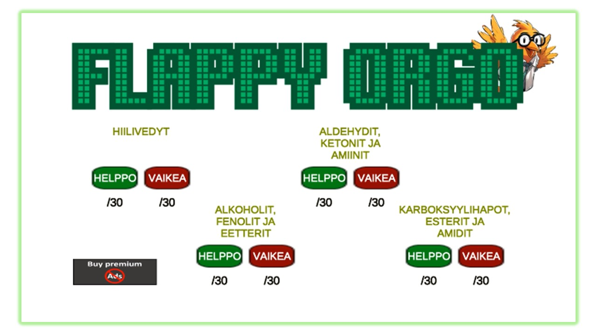
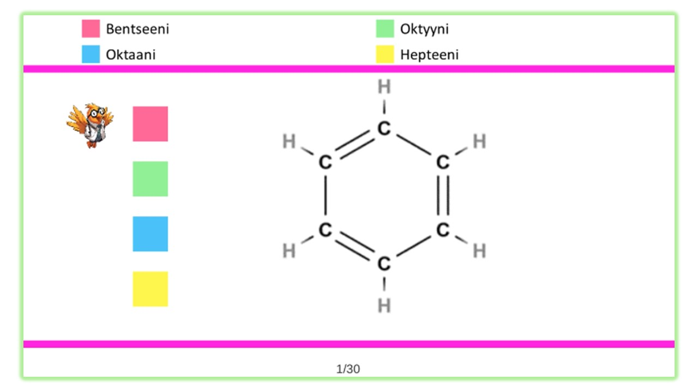
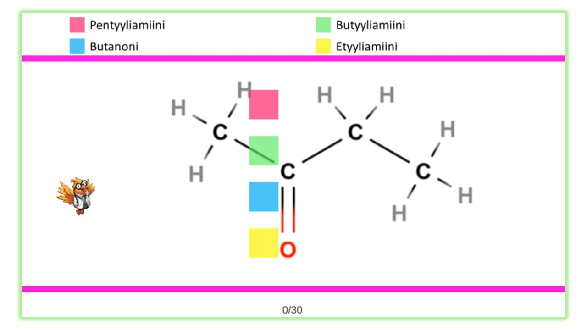
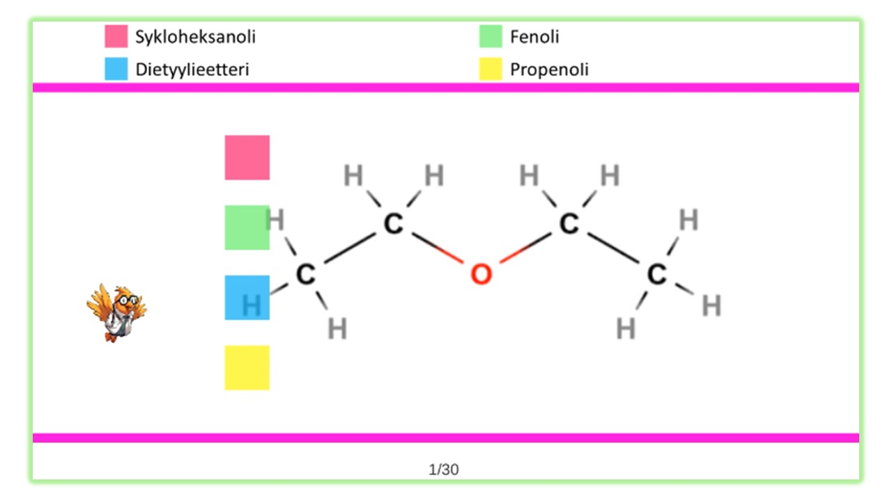
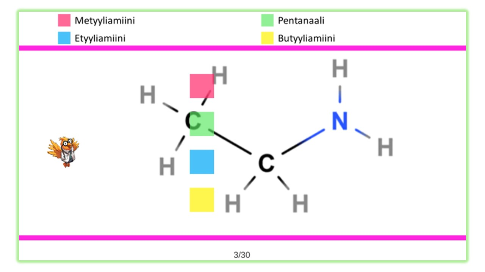

Flappy Orgo on mukaansatempaava oppimispeli, joka on suunniteltu tekemään orgaanisen kemian opiskelusta hauskaa ja interaktiivista. Tämä peli auttaa opiskelijoita hallitsemaan orgaanisten yhdisteiden nimiä ja rakennekaavoja, jotka ovat elintärkeitä menestykselle monilla tieteellisillä aloilla.

## Ominaisuudet
- Neljä kategoriaa:
  * Hiilivedyt
  * Alkoholit, fenolit ja eetterit
  * Aldehydit, ketonit ja amiinit
  * Karboksylihapot, esterit ja amidit
- Vaikeusasteet: Jokaisessa kategoriassa on kaksi vaikeusastetta, mikä tarjoaa yhteensä kahdeksan haastetta, joissa on 30 ainutlaatuista yhdistettä per taso.
- Interaktiivinen pelimekaniikka: Pelaajat navigoivat esteiden läpi samalla kun vastaavat monivalintakysymyksiin, mikä parantaa oppimista ja tiedon säilyttämistä.
- Edistymisen seuranta: Voit helposti seurata edistymistäsi ja kehitystäsi pelin aikana.
- Behavioristinen oppimisteoria: Peli perustuu behavioristisiin periaatteisiin, jotka korostavat toistamisen ja palautteen merkitystä tehokkaassa oppimisessa.

## Näyttökuvat

